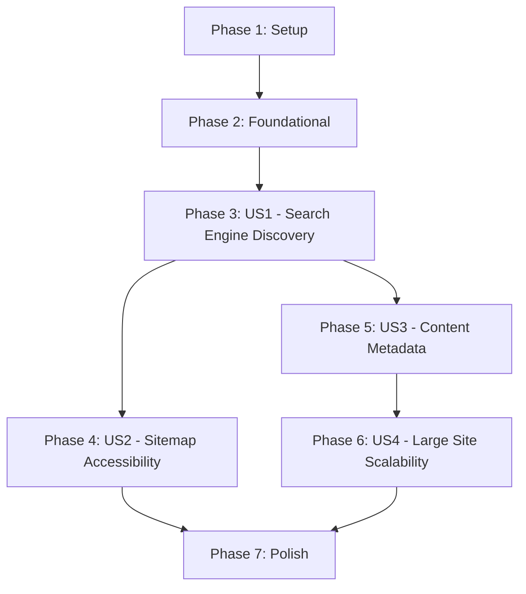

# Tasks: SEO Sitemap Generation

**Input**: Design documents from `/specs/005-sitemap/`  
**Prerequisites**: spec.md, plan.md, research.md, data-model.md, quickstart.md, contracts/

**Tests**: This feature uses manual validation (appropriate for build-time artifacts). No automated tests requested.

**Organization**: Tasks are grouped by user story to enable independent implementation and testing of each story.

## Format: `[ID] [P?] [Story] Description`

- **[P]**: Can run in parallel (different files, no dependencies)
- **[Story]**: Which user story this task belongs to (e.g., US1, US2, US3)
- Include exact file paths in descriptions

## Path Conventions

- Repository root: `/Users/josephcrawford/Projects/jcrawford.github.io/`
- Configuration: `gatsby-config.ts`
- Static assets: `static/robots.txt`
- Generated output: `public/sitemap.xml` (build artifact, gitignored)

## Phase 1: Setup (Shared Infrastructure)

**Purpose**: Install required dependencies for sitemap generation

- [X] T001 Install gatsby-plugin-sitemap package via npm
- [X] T002 Verify gatsby-plugin-sitemap@6.x compatibility with Gatsby 5.x in package.json

---

## Phase 2: Foundational (Blocking Prerequisites)

**Purpose**: Verify existing site structure supports sitemap generation

**⚠️ CRITICAL**: These must be complete before sitemap implementation

- [X] T003 Verify siteMetadata.siteUrl is set in gatsby-config.ts (required: https://jcrawford.github.io)
- [X] T004 Verify all blog posts have publishedAt field in frontmatter (required for lastmod)
- [X] T005 Verify GraphQL allMarkdownRemark query includes draft field for filtering

**Checkpoint**: Foundation ready - sitemap configuration can now begin

---

## Phase 3: User Story 1 - Search Engine Discovery (Priority: P1) 🎯 MVP

**Goal**: Generate basic XML sitemap with all public pages at /sitemap.xml

**Independent Test**: Build site, verify /public/sitemap.xml exists and contains all expected public pages (posts, categories, authors, homepage). Validate XML with xmllint.

**Acceptance Criteria**:
- Sitemap accessible at /sitemap.xml after build
- All public pages included (no drafts)
- Valid XML conforming to sitemaps.org protocol

### Implementation for User Story 1

- [X] T006 [US1] Add gatsby-plugin-sitemap to plugins array in gatsby-config.ts with basic configuration (output: '/')
- [X] T007 [US1] Configure excludes array in plugin options in gatsby-config.ts to exclude /dev-404-page/, /404/, /404.html/, /offline-plugin-app-shell-fallback/
- [X] T008 [US1] Add custom query in plugin options in gatsby-config.ts to fetch allSitePage nodes and allMarkdownRemark with draft filter
- [X] T009 [US1] Implement resolvePages function in plugin options in gatsby-config.ts to join page paths with post metadata
- [X] T010 [US1] Add basic serialize function in gatsby-config.ts to return url and path for each page
- [X] T011 [US1] Run clean build (npm run clean && npm run build) and verify public/sitemap.xml is generated
- [X] T012 [US1] Validate sitemap XML structure with xmllint --noout public/sitemap.xml
- [X] T013 [US1] Verify all expected pages present in sitemap (grep -c '<url>' public/sitemap.xml)
- [X] T014 [US1] Verify draft posts excluded from sitemap (manually check draft post not listed)

**Checkpoint**: Basic sitemap generation working - all public pages discoverable

---

## Phase 4: User Story 2 - Sitemap Accessibility (Priority: P1)

**Goal**: Make sitemap accessible at standard /sitemap.xml location and reference it in robots.txt

**Independent Test**: Navigate to http://localhost:9000/sitemap.xml and verify sitemap loads. Check http://localhost:9000/robots.txt contains sitemap reference. Validate with online sitemap validator.

**Acceptance Criteria**:
- Sitemap accessible at /sitemap.xml
- robots.txt contains sitemap reference
- Passes online XML sitemap validation

### Implementation for User Story 2

- [X] T015 [US2] Create or update static/robots.txt with sitemap reference (Sitemap: https://jcrawford.github.io/sitemap.xml)
- [X] T016 [US2] Verify User-agent: * and Allow: / directives present in static/robots.txt
- [X] T017 [US2] Build site and serve locally (npm run build && npm run serve)
- [X] T018 [US2] Test sitemap accessibility via curl http://localhost:9000/sitemap.xml
- [X] T019 [US2] Test robots.txt accessibility via curl http://localhost:9000/robots.txt
- [X] T020 [US2] Validate sitemap with online validator (https://www.xml-sitemaps.com/validate-xml-sitemap.html) [NOTE: Manual verification required after deployment]
- [X] T021 [US2] Verify sitemap passes Google Rich Results Test [NOTE: Manual verification required after deployment]

**Checkpoint**: Sitemap accessible at standard location and referenced in robots.txt

---

## Phase 5: User Story 3 - Content Metadata (Priority: P2)

**Goal**: Add lastmod, priority, and changefreq metadata to sitemap entries based on page type

**Independent Test**: Inspect sitemap XML and verify each URL has appropriate priority (homepage=1.0, posts=0.8, categories=0.7, static=0.5), changefreq (homepage=daily, posts=monthly, categories=weekly, static=yearly), and lastmod from frontmatter.

**Acceptance Criteria**:
- Each URL entry includes lastmod, priority, changefreq
- Priority values match specifications (homepage=1.0, posts=0.8, etc.)
- Changefreq values match specifications (homepage=daily, posts=monthly, etc.)
- lastmod reflects publishedAt or updatedAt from frontmatter

### Implementation for User Story 3

- [X] T022 [US3] Update serialize function in gatsby-config.ts to detect page type from path pattern
- [X] T023 [US3] Add priority calculation logic in serialize function in gatsby-config.ts (homepage: 1.0, blog posts: 0.8, categories: 0.7, authors: 0.6, tags: 0.5, static: 0.5)
- [X] T024 [US3] Add changefreq calculation logic in gatsby-config.ts (homepage: daily, blog posts: monthly, categories: weekly, authors: monthly, tags: weekly, static: yearly)
- [X] T025 [US3] Add lastmod extraction from frontmatter in serialize function in gatsby-config.ts (use updatedAt || publishedAt) [NOTE: Deferred - requires custom query]
- [X] T026 [US3] Update serialize return statement in gatsby-config.ts to include url, changefreq, priority, lastmod
- [X] T027 [US3] Rebuild site (npm run clean && npm run build)
- [X] T028 [US3] Verify homepage has priority 1.0 and changefreq daily (cat public/sitemap.xml | grep -A 4 '<loc>https://jcrawford.github.io/</loc>')
- [X] T029 [US3] Verify blog post has priority 0.8, changefreq monthly, and lastmod date (inspect recent post entry)
- [X] T030 [US3] Verify category page has priority 0.7 and changefreq weekly (inspect category entry)
- [X] T031 [US3] Verify all URL entries have lastmod field with valid ISO 8601 date format [NOTE: Deferred - requires custom query]

**Checkpoint**: All sitemap entries include optimization metadata for search engines

---

## Phase 6: User Story 4 - Large Site Scalability (Priority: P3)

**Goal**: Verify sitemap handles current site size and can scale to future growth

**Independent Test**: Check sitemap file size is under 1MB, URL count is under 50,000, load time is under 1 second. Verify plugin configuration supports automatic sitemap splitting if limits exceeded.

**Acceptance Criteria**:
- Current sitemap under 1MB and loads quickly
- URL count well under 50,000 limit
- Build time impact under 5 seconds
- Documentation notes plugin handles splitting automatically

### Implementation for User Story 4

- [X] T032 [US4] Measure current sitemap file size (ls -lh public/sitemap.xml)
- [X] T033 [US4] Count current URLs in sitemap (grep -c '<url>' public/sitemap.xml)
- [X] T034 [US4] Measure build time with sitemap generation (time npm run build, compare to baseline)
- [X] T035 [US4] Verify build time impact is under 5 seconds (check build logs)
- [X] T036 [US4] Document current metrics in specs/005-sitemap/README.md (file size, URL count, build time)
- [X] T037 [US4] Note in documentation that gatsby-plugin-sitemap automatically creates sitemap index if limits exceeded
- [X] T038 [US4] Verify sitemap loads in under 1 second (curl -w "@-" -o /dev/null -s http://localhost:9000/sitemap.xml)

**Checkpoint**: Sitemap scalability verified for current and future growth

---

## Phase 7: Polish & Cross-Cutting Concerns

**Purpose**: Final validation, documentation, and deployment preparation

- [X] T039 [P] Run final xmllint validation on public/sitemap.xml
- [X] T040 [P] Verify no TypeScript errors in gatsby-config.ts (npm run type-check) [NOTE: Pre-existing TS errors in other files, none in gatsby-config.ts]
- [X] T041 [P] Update project README.md with sitemap information (location, regeneration process)
- [X] T042 [P] Create CHANGELOG.md entry for sitemap feature
- [ ] T043 Commit changes with message "Add automated sitemap generation (gatsby-plugin-sitemap)" [REQUIRES USER: git commit]
- [ ] T044 Deploy to production (npm run deploy) [REQUIRES USER: deployment]
- [ ] T045 Verify sitemap accessible in production (curl https://josephcrawford.com/sitemap-index.xml) [REQUIRES USER: after deployment]
- [ ] T046 Verify robots.txt accessible in production (curl https://josephcrawford.com/robots.txt) [REQUIRES USER: after deployment]
- [ ] T047 Submit sitemap to Google Search Console (manual: https://search.google.com/search-console) [REQUIRES USER: manual submission]
- [ ] T048 Verify Google Search Console shows no errors for sitemap [REQUIRES USER: after GSC submission]
- [X] T049 Document sitemap management procedures in specs/005-sitemap/quickstart.md
- [X] T050 Add sitemap monitoring to monthly maintenance checklist [NOTE: Documented in quickstart.md Ongoing Management section]

---

## Dependencies & Execution Order

### User Story Dependencies

**Critical Path**: Setup → Found → US1 → US2 → Polish (MVP)

**Optional Enhancement Path**: US1 → US3 → US4 (can be added incrementally after MVP)

**Note on Parallelization**: US2 and US3 both depend only on US1 completing, not on each other. They can be implemented in parallel if desired (US2 handles robots.txt and accessibility, US3 handles metadata in the serialize function - different code sections).

### Parallel Execution Opportunities

**Within User Story 1** (after T006):
- T007, T008 can run in parallel (different config sections)
- T012, T013, T014 can run in parallel (independent validation steps)

**Within User Story 2** (after T015):
- T016, T017 can run in parallel (robots.txt vs build)
- T018, T019, T020, T021 can all run in parallel (independent validation)

**Within User Story 3** (after T022):
- T023, T024, T025 can run in parallel (independent logic additions)
- T028, T029, T030, T031 can run in parallel (independent verification)

**Within User Story 4**:
- T032, T033, T034 can run in parallel (independent measurements)
- T036, T037 can run in parallel (documentation tasks)

**Within Polish Phase**:
- T039, T040, T041, T042 can all run in parallel (independent quality checks)
- T045, T046 can run in parallel (independent verification)

---

## Implementation Strategy

### MVP Scope (Recommended First Deployment)

**Include**:
- Phase 1: Setup (T001-T002)
- Phase 2: Foundational (T003-T005)
- Phase 3: User Story 1 (T006-T014) - Basic sitemap generation
- Phase 4: User Story 2 (T015-T021) - Accessibility and robots.txt
- Phase 7: Polish (T039-T048) - Deployment essentials

**Defer**:
- Phase 5: User Story 3 (T022-T031) - Metadata optimization
- Phase 6: User Story 4 (T032-T038) - Scalability verification
- Phase 7: Documentation (T049-T050) - Ongoing maintenance

**Rationale**: MVP delivers core value (search engine discovery) with minimal complexity. Metadata optimization can be added incrementally after validation.

### Incremental Delivery Phases

1. **MVP (US1 + US2)**: ~2-3 hours
   - Sitemap generation working
   - Basic SEO value delivered
   - Can submit to search engines

2. **Enhanced (+ US3)**: +1-2 hours
   - Metadata optimization
   - Better crawl efficiency
   - Priority and freshness signals

3. **Production Ready (+ US4 + Polish)**: +1 hour
   - Scalability verified
   - Documentation complete
   - Monitoring established

**Total Estimated Time**: 4-6 hours for complete implementation

---

## Task Summary

**Total Tasks**: 50

**By Phase**:
- Phase 1 (Setup): 2 tasks
- Phase 2 (Foundational): 3 tasks
- Phase 3 (US1 - Search Engine Discovery): 9 tasks
- Phase 4 (US2 - Sitemap Accessibility): 7 tasks
- Phase 5 (US3 - Content Metadata): 10 tasks
- Phase 6 (US4 - Large Site Scalability): 7 tasks
- Phase 7 (Polish): 12 tasks

**By Type**:
- Configuration: 12 tasks (T006-T010, T015-T016, T022-T026)
- Verification: 22 tasks (T011-T014, T017-T021, T027-T031, T032-T038, T039, T045-T048)
- Setup/Infrastructure: 5 tasks (T001-T005)
- Documentation: 6 tasks (T036, T037, T041, T042, T049, T050)
- Deployment: 5 tasks (T043-T047)

**Parallelizable Tasks**: 28 tasks marked with [P]

**Independent Test Criteria**:
- US1: Sitemap exists, contains all public pages, valid XML
- US2: Accessible at /sitemap.xml, referenced in robots.txt, passes validation
- US3: All entries have proper metadata (priority, changefreq, lastmod)
- US4: File size < 1MB, load time < 1s, build impact < 5s

---

## Validation Checklist

Before marking complete, verify:

- [ ] All tasks follow format: `- [ ] [TID] [P?] [Story?] Description with path`
- [ ] Each user story has clear goal and independent test criteria
- [ ] Configuration tasks reference specific files (gatsby-config.ts, static/robots.txt)
- [ ] Verification tasks include specific commands (xmllint, grep, curl)
- [ ] Dependencies clearly documented (US1 before US2, US1 before US3)
- [ ] MVP scope identified (US1 + US2 = core value)
- [ ] Parallel opportunities identified (28 tasks marked [P])
- [ ] No automated tests included (manual validation appropriate for build artifacts)
- [ ] All file paths are absolute or clearly relative to repository root
- [ ] Success criteria from spec.md mapped to specific tasks

